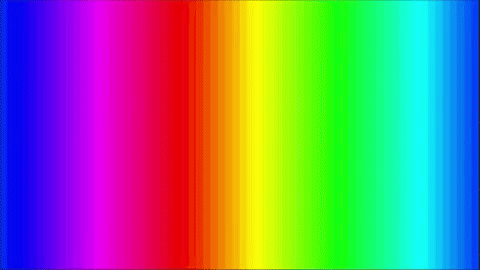
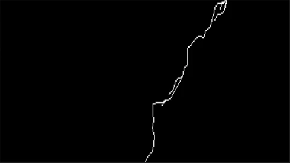
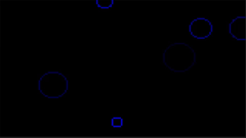
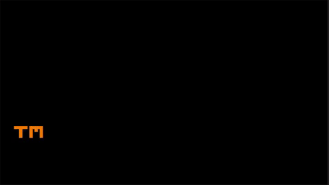
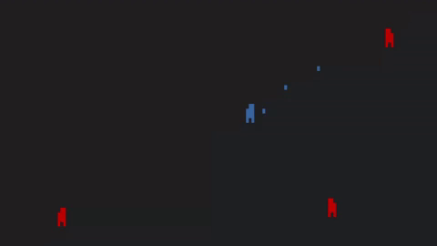

# Termule Demos

This directory contains the demo project for the Termule game engine. Each demo highlights a specific engine capability and serves as a simple, but practical example of interacting with the Termule API. For this reason, demo source code prioritizes clarity and elegance over raw performance. 

For information about the engine itself, see the main README [here](../README.md).

## Demos

Below is a list of the included demos and the functionality they demonstrate.

- *gradient* - full RGB colors



- *lightning* - line rendering



- *raindrops* - circle rendering



- *screensaver* - runtime loading and positioning of content



- *shooter* - input handling



## Running

After cloning the full Termule repository, you can run this project from the repository root via the .NET CLI with:

```bash
dotnet run --project Demos
```

for a list of demos, or to run a specific demo by name:

```bash
dotnet run --project Demos <demo>
```